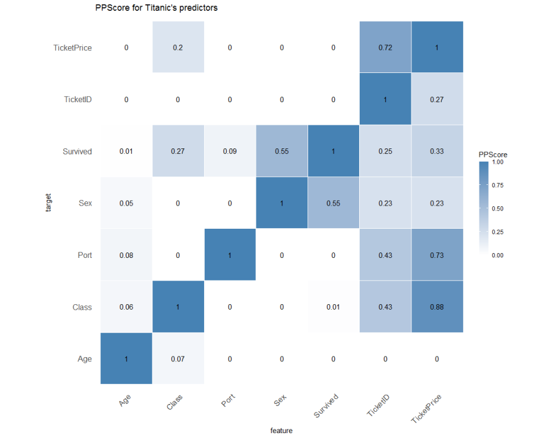
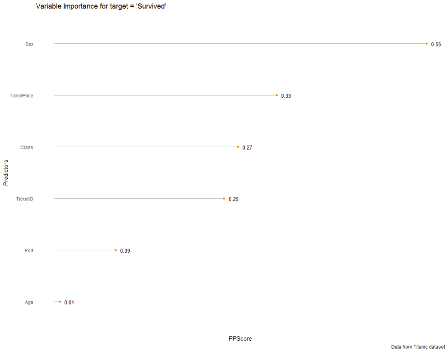
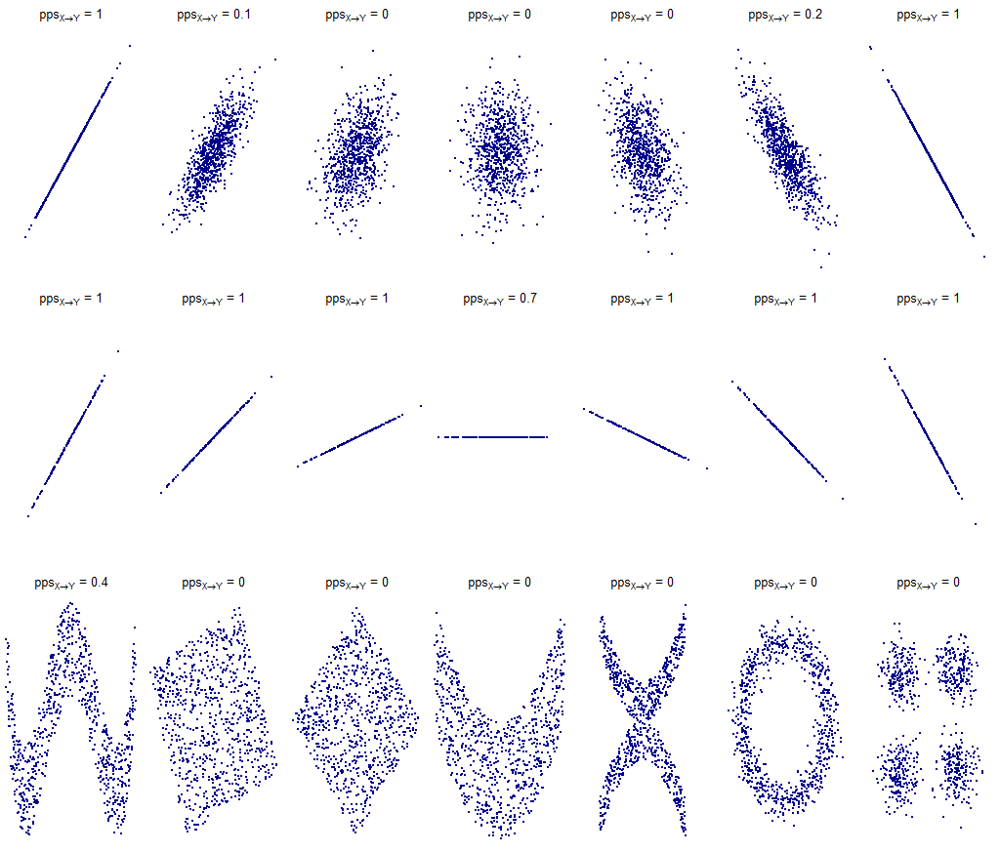
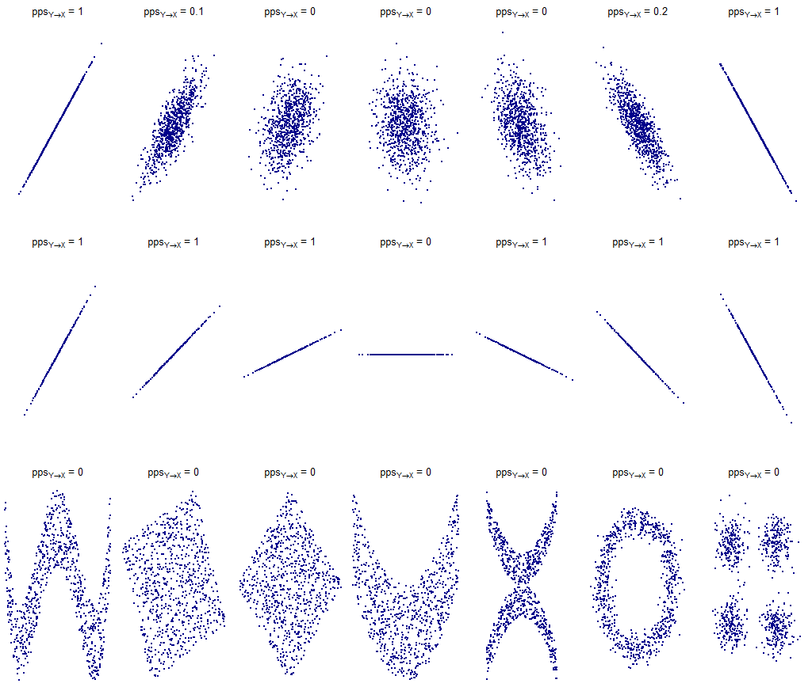

# Using The Predictive Power Score in R
In recent months Florian Wetschoreck published a story on Toward Data Science's Medium channel that attracted the attention of many data scientists on LinkedIn thanks to its very provocative title: "RIP correlation. Introducing the Predictive Power Score".

The Predictive Power Score (PPS) is a normalized index (it ranges from 0 to 1) that tells us how much the variable x (be it numerical or categorical) could be used to predict the variable y (numerical or categorical). The higher the PPS index, the more the variable x is decisive in predicting the variable y.

I wrote a blog a post to summarize the pros and cons of this new index:

[Using The Predictive Power Score in R](https://towardsdatascience.com/using-the-predictive-power-score-in-r-26c43d05dc01)

I also collected all the R code needed to reproduce the examples shown in the blog post into this repository.

Here are some graphs obtained thanks to the aforementioned R code.
The PPScore version used to get the shown results is 1.1.0.

## PPScore Heatmap for Titanic's Predictors

## PPScore Variable Importance for target = 'Survived'

## PPScore for "x predicts y" over the Boigelot distributions

## PPScore for "y predicts x" over the Boigelot distributions

